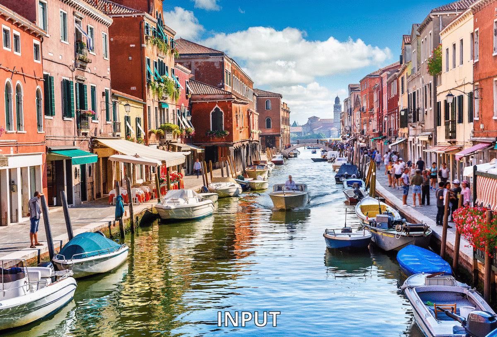
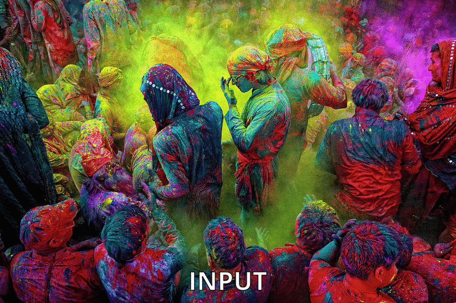
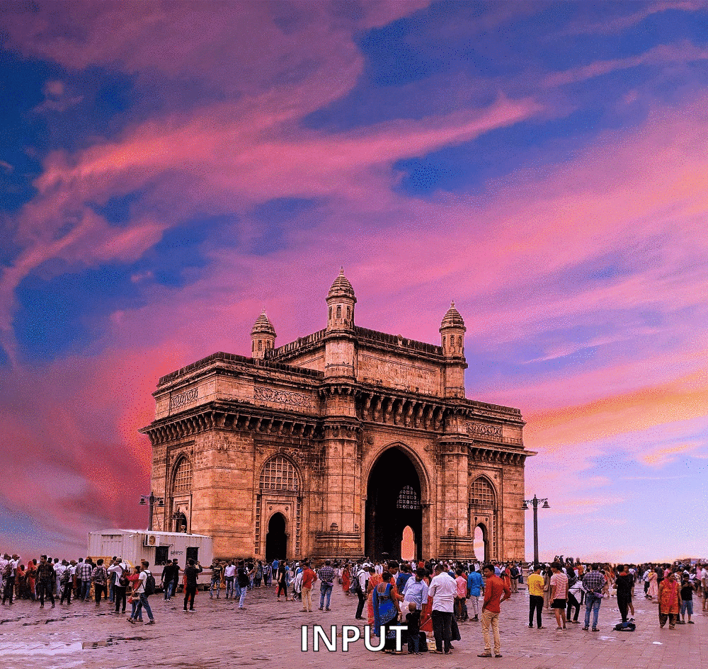

# Non-Photorealistic Rendering

This project generates acrylic styled paintings from photographs. It accomplishes this by calculating gradient vectors calculated from applying the Sobel operator on an image in order to produce a result with better defined edges that we can manipulate. From this, we create a smooth direction field, or edge tangent flow, from our sobel images that we can then apply stylistic changes to at our discretion. For this project, we used the values of defined edge lines as well as the average neighborhood (5x5) color for each pixel in order to create an acrylic stylization of an input image. All of the above mentioned features are implemented via vertex/fragment shaders that we defined using GLSL as well as the input parameters fed into the shaders via OpenGL.

## Demonstration

**[Italy screenshots](https://github.com/brainleq/Non-Photorealistic-Rendering/tree/master/npr/images/italy_output)**

**[Holi screenshots](https://github.com/brainleq/Non-Photorealistic-Rendering/tree/master/npr/images/holi_output)**

**[Mumbai screenshots](https://github.com/brainleq/Non-Photorealistic-Rendering/tree/master/npr/images/mumbai_output)**

* **More examples can be found [here](https://github.com/brainleq/Non-Photorealistic-Rendering/tree/master/npr/images)**

## Usage

* Load in a JPG.
* Pressing numbers 1-5 will render each step of the painting generation (as shown in the sample gifs above).
* Pressing J will screenshot the window and save the image as a BMP file.

## Built With

* [GLEW](http://glew.sourceforge.net/) - Modern OpenGL
* [GLFW](https://www.glfw.org/) - OpenGL window
* [SOIL](https://www.lonesock.net/soil.html) - Image loading and saving
* These tools are already installed in [Dependencies](https://github.com/brainleq/Non-Photorealistic-Rendering/tree/master/Dependencies) and static links should already be set up for npr.sln

## Authors

* **Brian LeQuang** - [brainleq](https://github.com/brainleq)
* **Tarun Prince** - [Tarun-Prince99](https://github.com/Tarun-Prince99)

## References

* [Coherent Line Drawing](http://umsl.edu/mathcs/about/People/Faculty/HenryKang/coon.pdf)
* [Flow-Based Image Abstraction](http://www.cs.umsl.edu/~kang/Papers/kang_tvcg09.pdf)
* [REAL-TIME NON-PHOTOREALISTIC RENDERING](https://pille.iwr.uni-heidelberg.de/~npr01/)
* [Artistic Stylization of Images and Video](http://kahlan.eps.surrey.ac.uk/EG2011/eg2011-npr3.pdf)

